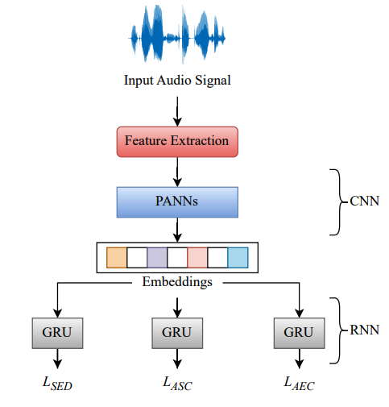

DCASE 2023 Workshop - Task 4B
-----------------------------

Author:
**Tanmay Khandelwal**
[Email](mailto:tanmay24.cs@gmail.com)

Getting started
===============

1. Clone repository from [Github](https://github.com/tanmayy24/MTL-DCASE-2023-Task-4b)
2. Install requirements with the command: `pip install -r requirements.txt`
3. Extract features from the audio files **previously** downloaded `python extract_features.py`
4. Run the task-specific application with default settings `python task4b_panns_mtl.py` 

### Anaconda installation

To setup the Anaconda environment for the system use the following:

	conda create --name dcase-t4b python=3.6
	conda activate dcase-t4b
	conda install numpy
	conda install pytorch torchvision torchaudio pytorch-cuda=11.6 -c pytorch -c nvidia
	pip install torchinfo
	pip install librosa
	pip install pandas
	pip install sklearn
	pip install sed_eval
    pip install dcase_util
    pip install sed_scores_eval
	

Description
============

This is the workshop work for the subtask of the Sound Event Detection task 4 of the Acoustic Scene Classification in Detection and Classification of Acoustic Scenes and Events 2023 (DCASE2023) challenge. This work is built on [dcase_util](https://github.com/DCASE-REPO/dcase_util) toolbox (>=version 0.2.16). 

### Data preparation
     extract_features.py       # Code to extract features from the development files

Description
========

### Task 4B - Sound Event Detection with Soft Labels 

[MAESTRO Real - Multi-Annotator Estimated Strong Labels](https://zenodo.org/record/7244360) is used as the development dataset for this task.

This task is a subtopic of the Sound Event Detection Task 4, which provides three 
kinds of data for training; weakly-labeled data (without timestamps), strongly-labeled data
(with timestamps), and unlabeled data. The target of the systems is to provide not only the 
event class but also the event time localization given that multiple events can be present in an audio recording

This task is concerned with another type of training data:
- Soft labels provide a number between 0 and 1 that characterize the certainty of human annotators
 	for the sound at that specific time.
- Temporal resolution of the provided data is 1 second (due to the annotation procedure)
- Development data is provided with both soft (between 0 and 1) labels.
- Systems will be evaluated against hard labels

The task-specific model is implemented in file `models/PANNS_CRNN_mtl.py`.

#### System description

The system implements a pretrained audio neural networks (PANNs) based approach and three bi-directional gated recurrent units (bi-GRU) for each layer. 
As input the model uses mel-band energies extracted using a hop length of 200 ms and 64 mel filter banks. 

#### Parameters

##### Acoustic features

- Analysis frame 400 ms (50% hop size)
- Mel-band energies (64 bands)

##### Neural network

- Input shape: sequence_length * 64 
- Architecture:
  - PANNs (CNN-14)
  - Permute
  - Bidirectional GRU #1/#2/#3
  - Dense layer #1
    - Dense layer (units: 64, activation: Linear )
    - Dropout (rate: 30%)
  - Dense layer #2
    - Dense layer (units: 32, activation: Linear )

- Learning (epochs: 150, batch size: 32, data shuffling between epochs)
  - Optimizer: Adam (learning rate: 0.001)
- Model selection:
  - Approximately 30% of the original training data is assigned to the validation set
  - Model performance after each epoch is evaluated on the validation set, and the best-performing model is selected
  
  
#### Results for development dataset

A cross-validation setup is used to evaluate the performance of the baseline system.
Micro-averaged-scores (ER_m, F1_m) and macro-averaged-score (F1_M) are calculated using [sed-eval](https://tut-arg.github.io/sed_eval/index.html) toolbox 
segment-based 1 second. Macro-averaged score class-wise with optimal threshold (F1_{th_op}) is calculated using [sed-scores-eval](https://github.com/fgnt/sed_scores_eval) segment-based 1 second. 
 
    
	|          |        ER_m        |        F1_m         |        F1_M         |       F1_{th_op}    |
	|----------|--------------------|---------------------|---------------------|---------------------|
	| Baseline |  0.487 (+/-0.009)  |  70.34% (+/-0.766)  |  35.83% (+/-0.660)  |  42.87% (+/-0.840)  |
 	| MTL Setup|  0.406             |  76.61%             |  39.87%             |  49.30%             |

                                                                        

Usage
=====

For running the CRNN model:
- `extract_features.py`, first extract mel-bands and normalize data
- `task4b_panns_mtl.py.py`, Proposed DCASE 2023 system for Task 4B

Code
====

The code is built on [dcase_util](https://github.com/DCASE-REPO/dcase_util) toolbox, see [manual for tutorials](https://dcase-repo.github.io/dcase_util/index.html). The machine learning part of the code is built on [Pytorch (v1.10.2)](https://pytorch.org/).

